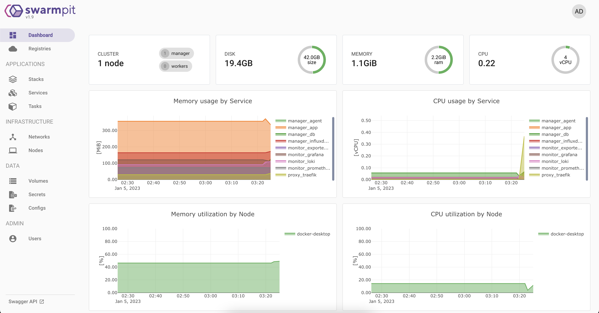
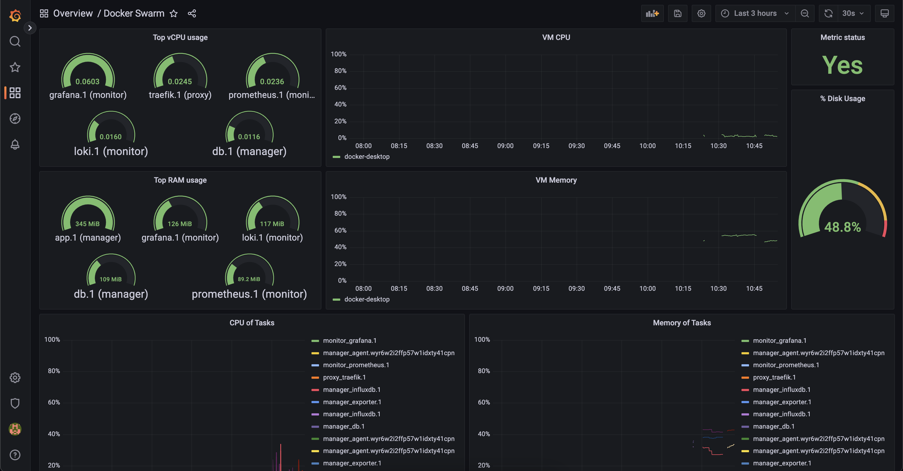
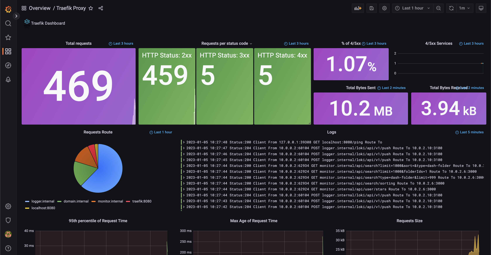
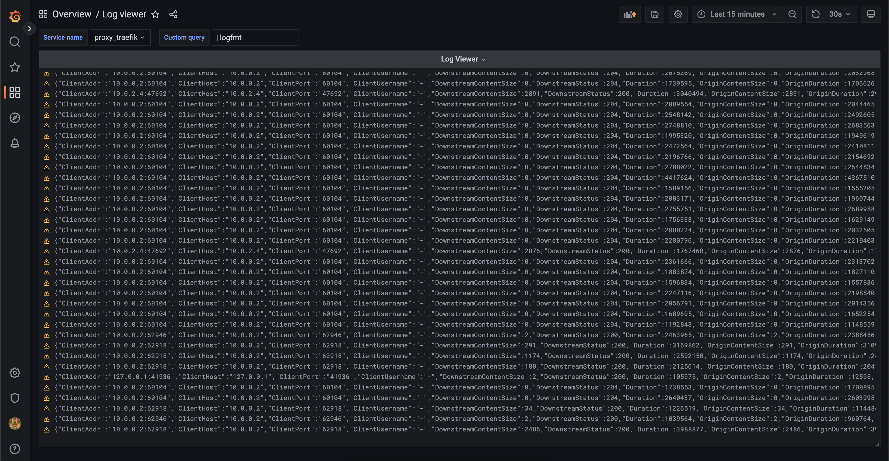
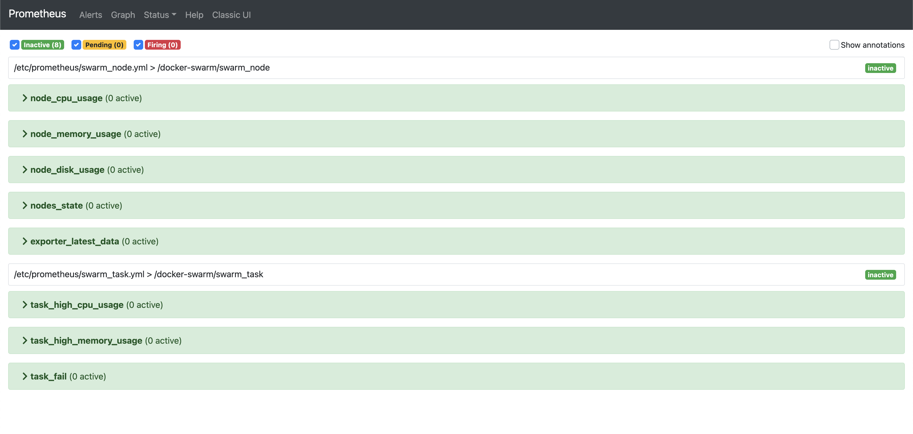
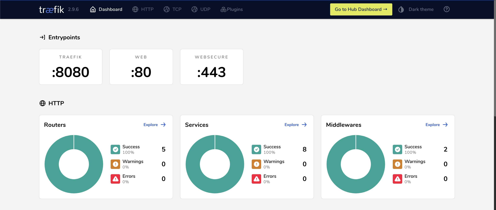

## Setup server

- Run command in file `setup-server.sh <server ip>`
- Run commands listed in `Security.md`
- Get join token from swarm manager `docker swarm join-token worker`
- Run this token in new server
- Add label for swarm node

## Swarm modules

- Explore `modules` folder to choose what you want to use
- 3 recommended modules are: `proxy`, `manager`, `monitor`

### Manager: swarmpit



### Monitor: grafana, prometheus









### Proxy: Traefik



## Create wildcard SSL for traefik

- Edit domain you want to create wildcard SSL in file `modules/proxy/config/ssl.yml`
- Create empty json file `acme-dns.json`
- Run command below and follow instructions

```bash
docker run -it --rm -v '/var/run/docker.sock:/var/run/docker.sock:ro' -v "$(pwd):/ce" traefik:v2.4 sh -c 'chmod 600 /ce/acme-dns.json && traefik --api --providers.file.filename=/ce/config/ssl.yml --entrypoints.web.address=:80 --certificatesresolvers.dns.acme.email=support@domain.com.vn --certificatesresolvers.dns.acme.storage=/ce/acme-dns.json --certificatesresolvers.dns.acme.dnschallenge=true --certificatesresolvers.dns.acme.dnschallenge.provider=manual --certificatesresolvers.dns.acme.dnschallenge.delaybeforecheck=0 --log'
```

- Update name of secret `acme-dns` to `dev-acme-dns-v2` in file `traefik-dev.docker-compose.yml` and redeploy

```bash
docker --context=swarm-dev stack deploy -c ./modules/proxy/traefik-dev.docker-compose.yml proxy
```

## Restore backup file

- Access to vm DB
- To be sure, copy current data of service before restore `docker cp <container id of service>:<data path> ./data-backup/`
- Pause service `docker service scale <service-name>=0`
- Run a container with following cmd

```bash
docker run --rm -it -v <volume of service>:<data path> -v <backup volume of service>:/backup -u mysql mysql:5.7 bash
```

- Inside container, extract backup: `gunzip -c /backup/backup-20210726-170004.sql.gz > /var/lib/mysql/backup.sql`
- Run mysql deamon in container: `docker-entrypoint.sh mysqld --skip-grant-tables &`
- Run backup script: `mysql -u root -p < /var/lib/mysql/backup.sql`
- Delete backup file: `rm /var/lib/mysql/backup.sql`
- Finally exit container and run service again: `docker service scale <service-name>=1`

## License
Licensed under [MIT](./LICENSE).
